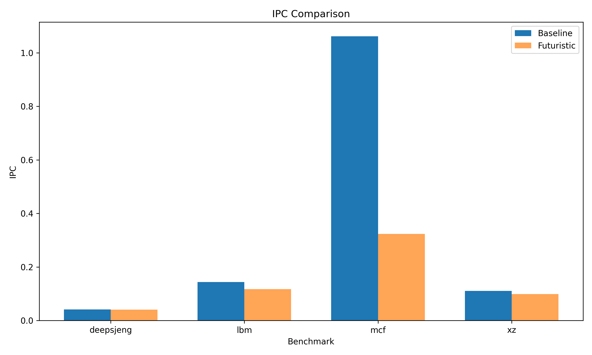
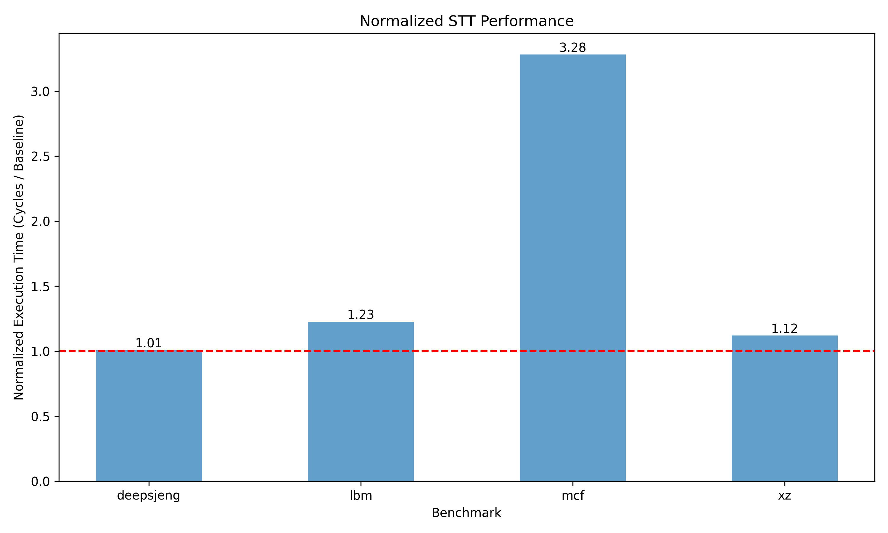

# Speculative Taint Tracking in gem5: Design and Performance Evaluation

**Seulah Kim, Wonchan Kim**

Simon Fraser University  

---

## Abstract

---

## 1. Introduction

---

## 2. Background

Speculative Execution and Spectre

Out-of-Order Processors

Speculative Taint Tracking (STT)

---

## 3. System Design and Implementation

---

## 4. Evaluation

### 4.1 Experimental Setup

All experiments are performed using the gem5 simulator with the out-of-order (O3) CPU model. The simulation environment is used to evaluate the performance impact of Speculative Taint Tracking (STT).

The evaluation compares two configurations: a baseline processor without STT and a processor with STT enabled using the Futuristic threat model. 

Benchmarks from the SPEC CPU2017 are used to represent realistic workloads. Each benchmark is executed in the gem5 simulation environment, and performance data is collected from the simulator output.

To keep the simulation time reasonable, each benchmark is executed for a maximum of 15 million instructions. Since simulation in gem5 is computationally expensive, this limit allows experimentations to finish in a practical amount of time while still allowing fair comparison. Both configurations are evaluated under same execution conditions to ensure fair comparison.

### 4.2 Performance Metrics

To evaluate the performance impact of Speculative Taint Tracking (STT), two metrics are used.

Instructions Per Cycle (IPC) measures how many instructions are executed per cycle. It shows how efficiently the processor is running. A lower IPC indicates reduced performance.

Normalized execution time is calculated by dividing the execution time (in cycles) of the STT-enabled configuration by the execution time of the baseline configuration. A value greater than 1 indicates that the STT-enabled configuration takes longer to execute, representing performance overhead.

### 4.3 Results

|:--:| 
| **Figure 1: IPC Comparison between Configurations** |

|:--:| 
| **Figure 2: Normalized Execution Time of STT relative to Baseline** |

Figure 1 shows the IPC comparison between the baseline and STT-enabled configurations. Across all benchmarks, IPC decreases when STT is enabled, indicating a performance slowdown. The performance drop is relatively small for `deepsjeng`, `lbm`, and `xz` where IPC values remain close to the baseline. However, `mcf` shows a significant drop in IPC, with the STT-enabled configuration achieving much lower throughput. This reduction in IPC directly corresponds to the increased execution time observed in Figure 2.

Figure 2 shows the normalized execution time of the STT-enabled configuration relative to the baseline. The results follow a similar trend. `deepsjeng`, `lbm`, and `xz` show only modest overhead, but `mcf` shows a significant slowdown of approximately 3.28x, indicating a substantial performance degradation.

The results indicate that the performance overhead introduced by STT is highly dependent on the workload. The `mcf` benchmark shows the largest slowdown because it is memory-bound and dominated by pointer-chasing behavior. In our implementation, taint propagation introduces additional dependency tracking and increases pipeline stalls, which particularly affects workloads with long chains of dependent memory operations. In contrast, benchmarks with fewer memory dependencies experience significantly lower overhead.

### 4.4 Limitations

---

## 5. Conclusion

---

## 6. References

---

## 7. Appendix

### 7.1 Project Contributions

### 7.2 How to Run the Code